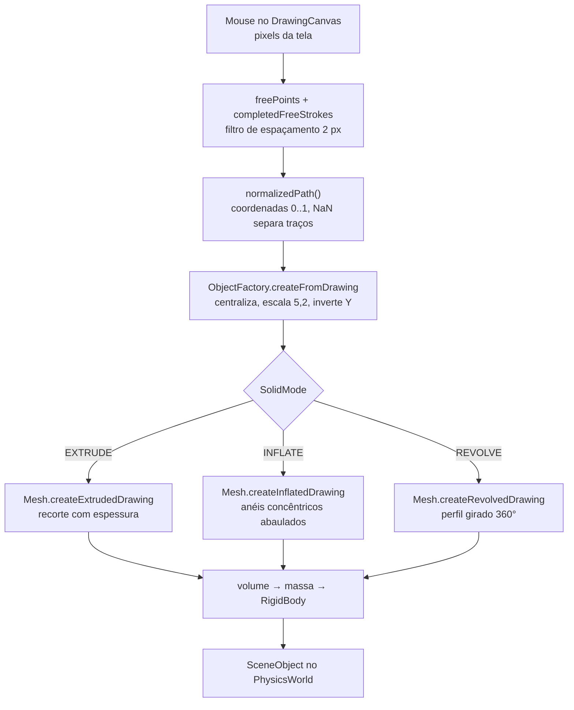

# Desenho livre em 3D

Documentação técnica do caminho que leva um rabisco 2D a um corpo rígido 3D dentro do
`PhysicsWorld`: os três modos de geração, os algoritmos, as decisões de projeto, os bugs
encontrados no caminho e como tudo foi verificado.

---

## Índice

1. [O ponto de partida e o problema](#o-ponto-de-partida-e-o-problema)
2. [Visão geral do pipeline](#visão-geral-do-pipeline)
3. [Fase 1: captura do traço](#fase-1-captura-do-traço)
4. [Fase 2: normalização e escala](#fase-2-normalização-e-escala)
5. [Fase 3: geração da malha](#fase-3-geração-da-malha)
   - [Modo Extrudar](#modo-extrudar-placa)
   - [Modo Inflar](#modo-inflar-volume)
   - [Modo Revolução](#modo-revolução-torno)
6. [Fase 4: massa a partir do volume](#fase-4-massa-a-partir-do-volume)
7. [Bugs encontrados e corrigidos](#bugs-encontrados-e-corrigidos)
8. [Verificação](#verificação)
9. [Mapa do código](#mapa-do-código)
10. [Limites conhecidos](#limites-conhecidos)

---

## O ponto de partida e o problema

A versão anterior tinha um único caminho: `createExtrudedDrawing`. Ele pegava o contorno
desenhado, triangulava o interior e empurrava as faces para frente e para trás numa espessura
constante.

O resultado é um **recorte de chapa**, como um cortador de biscoito. Um círculo desenhado virava
um disco chato, não uma esfera. Havia geometria tridimensional (vértices com coordenada Z), mas não
havia **volume**: a forma não tinha barriga, não tinha profundidade variável, não era um sólido no
sentido que a pessoa espera ao desenhar um bichinho e mandar virar 3D.

O objetivo foi acrescentar dois modos que produzem sólidos de verdade, mantendo a extrusão para os
casos em que ela é a resposta certa (placas, letreiros, peças planas).

---

## Visão geral do pipeline



Cada fase tem uma responsabilidade única, e a fronteira entre elas é um formato de dados simples -
o que permite testar cada parte isoladamente.

---

## Fase 1: captura do traço

**Arquivo:** `ui/DrawingCanvas.java`

O canvas guarda dois níveis de estado:

| Campo | Papel |
|---|---|
| `freePoints` | traço **em andamento**, do botão pressionado até soltar |
| `completedFreeStrokes` | traços já concluídos, acumulados até criar o objeto |

Isso permite desenhar uma figura composta (corpo, cabeça, duas orelhas) antes de gerar o sólido.

### Filtro de espaçamento

```java
if (Math.hypot(endX - previousX, endY - previousY) < MIN_POINT_SPACING_PX) {
    endX = previousX;
    endY = previousY;
    return;
}
```

Um arrasto lento gera centenas de pontos praticamente no mesmo lugar. Eles não mudam a forma, mas
inflam a malha 3D e o custo de repintura. O piso de **2 px** descarta esse ruído na origem.

### Desenho incremental

Este ponto é sutil e foi origem de um travamento (ver [bug 3](#bug-3-desenhar-ficava-mais-lento-a-cada-traço)).
No modo livre, cada evento de mouse desenha **apenas o segmento novo**:

```java
gc.strokeLine(previousX, previousY, endX, endY);   // O(1) por evento
```

Redesenhar tudo a cada ponto custaria O(pontos já desenhados) por evento, comportamento quadrático
no total. As formas geométricas (retângulo, círculo, triângulo) continuam com repintura completa,
porque mudam inteiras a cada movimento e são definidas por só dois pontos.

---

## Fase 2: normalização e escala

**Arquivos:** `ui/DrawingCanvas.normalizedPath()`, `scene/ObjectFactory.createFromDrawing()`

### Formato de intercâmbio

O canvas entrega uma `List<double[]>` em coordenadas **normalizadas 0..1**, com traços separados por
um ponto `NaN`:

```
[0,32; 0,41]  [0,35; 0,44]  ...  [NaN; NaN]  [0,60; 0,20]  ...
                                    ▲
                          "levantar a caneta"
```

O separador `NaN` é o que permite figuras compostas sem que a malha ligue o fim de um traço ao
início do próximo.

### Transformação para o espaço da cena

```java
double scale = 5.2;
double cx = (minX + maxX) * 0.5;      // centro do desenho
double cy = (minY + maxY) * 0.5;

double x = (p[0] - cx) * scale;
double y = (cy - p[1]) * scale;       // Y invertido: a tela cresce para baixo
```

Três coisas acontecem aqui:

1. **Centralização.** O objeto nasce centrado na própria origem, não no canto do canvas.
2. **Escala.** O fator 5,2 leva um desenho que ocupa o canvas inteiro a cerca de 5 unidades de
   cena, tamanho comparável aos outros objetos do sandbox.
3. **Inversão do Y.** A coordenada de tela cresce para baixo; a da cena, para cima.

### Dimensões derivadas

```java
double width  = max(0,15; (maxX - minX) · escala)
double height = max(0,15; (maxY - minY) · escala)
double depth  = clamp((width + height) · 0,08 ; 0,12 ; 0,50)   // espessura da placa
double inflateThickness = max(0,10 ; min(width, height) · 0,42) // meia-espessura do inflado
```

A espessura acompanha o tamanho do desenho: uma figura grande ganha um sólido proporcionalmente
mais espesso, o que evita tanto a placa fininha quanto o cubo desproporcional.

---

## Fase 3: geração da malha

**Arquivo:** `renderer/Mesh.java`

### Modo Extrudar (placa)

O modo original, mantido. Para cada traço:

```java
if (isClosedContour(stroke, strokeRadius)) {
    addExtrudedContour(m, trimClosedContour(stroke, strokeRadius), depth);  // sólido
} else {
    copyTriangles(m, createExtrudedStroke(...));                            // fita
}
```

Um traço conta como **fechado** quando a distância entre a primeira e a última ponta é menor que
12% da diagonal do desenho, tolerância que aceita o fechamento imperfeito de um traço à mão.

Contorno fechado é triangulado por *ear clipping* e as faces são deslocadas para ±`depth/2`, com
uma parede lateral ligando as duas. Traço aberto vira uma fita de seção retangular.

**Corte transversal:**

```
        ┌──────────────────────┐   +depth/2
        │       (miolo)        │
        └──────────────────────┘   −depth/2
        espessura constante
```

---

### Modo Inflar (volume)

O contorno fechado vira um sólido abaulado, grosso no centro, afinando até zero na borda.

#### O algoritmo

**Passo 1.** Reamostragem: O contorno é reamostrado em **44 pontos igualmente espaçados ao longo
do perímetro** (`resampleClosed`). Isso desacopla a contagem de triângulos do número de pontos que
o usuário desenhou: um rabisco de 2000 pontos e um de 60 geram a mesma malha.

**Passo 2.** Anéis concêntricos: O contorno é encolhido em direção ao centroide em `K = 7` anéis:

```java
double shrink = (double) k / INFLATE_RINGS;          // k = 1..7
x = center.x + (p.x - center.x) * shrink;
y = center.y + (p.y - center.y) * shrink;
```

O anel `k = 7` é o contorno desenhado; o `k = 1` está próximo do centro.

**Passo 3.** Perfil de altura: Cada anel recebe uma altura com perfil **circular**:

```
h(k) = espessura · √(1 − (k/K)²)
```

| Anel k | k/K | Altura |
|---|---|---|
| 1 | 0,14 | 0,99 · espessura |
| 4 | 0,57 | 0,82 · espessura |
| 6 | 0,86 | 0,51 · espessura |
| 7 | 1,00 | **0** |

Essa é a equação de um quarto de círculo. A consequência importante: no anel externo a altura é
**exatamente zero**, então as metades de cima e de baixo se encontram no contorno desenhado, a
silhueta vista de frente é exatamente o que a pessoa desenhou, e o sólido fecha sem costura.

**Corte transversal:**

```
                    ápice
                      ▲
              ┌───────┴───────┐        h = espessura
          ┌───┘               └───┐
      ┌───┘                       └───┐
   ───┴───────────────────────────────┴───   h = 0  (contorno desenhado)
      └───┐                       ┌───┘
          └───┐               ┌───┘
              └───────┬───────┘
                      ▼
```

**Passo 4.** Faixas e calotas: Quadriláteros ligam anéis vizinhos (`k` a `k+1`), em cima e
embaixo, com enrolamento invertido na face de baixo. As duas calotas são leques do ápice até o
anel 1.

#### Contagem de triângulos

```
faixas:   (K−1) · n · 2 lados · 2 triângulos = 6 · 44 · 2 · 2 = 1056
calotas:  n · 2 lados                        =     44 · 2     =   88
                                                    total     = 1144
```

Constante, independentemente do desenho.

#### Por que anéis, e não uma grade

A alternativa clássica (algoritmo do *Teddy*) triangula o interior e calcula a altura pela distância
até a borda. Exige triangulação de Delaunay com restrições e tratamento de células que cruzam o
contorno.

A abordagem por anéis dá o mesmo resultado visual para formas visíveis a partir do centroide, o
caso de praticamente todo desenho à mão, com uma fração da complexidade, e garante por construção
que a borda seja exata e a malha feche. Formas muito reentrantes degradam suavemente (os anéis
internos podem se sobrepor), sem quebrar.

---

### Modo Revolução (torno)

O traço vira o perfil de uma peça de torno.

#### O algoritmo

**Passo 1.** Eixo: O eixo de giro é a **borda esquerda** do desenho:

```java
private static double revolutionAxis(List<Vec3> path) {
    // menor X de todo o traço
}
```

Girar em torno do **centro** faria o sólido furar a si mesmo, porque os dois lados do traço se
sobreporiam ao dar a volta. Usando a borda, todo o traço fica de um lado só do eixo, que é
exatamente como se opera um torno de verdade.

**Passo 2.** Ordenação por altura: O perfil é ordenado por Y. Um torno sobe monotonicamente; sem
ordenar, um traço desenhado de baixo para cima e depois de volta produziria anéis fora de ordem.

**Passo 3.** Anéis de revolução: Cada ponto do perfil vira um anel de `S = 28` passos:

```java
double radius = max(0,01; |p.x − axisX|);
ring[r][s] = new Vec3(radius · cos(θ), p.y, radius · sin(θ));   θ = 2π·s/S
```

**Passo 4.** Costura e tampas: Quadriláteros ligam anéis consecutivos; leques fecham as duas
pontas.

```
     perfil desenhado          sólido gerado
                              
          │ ╲                      ╭───╮
     eixo │  ╲                    ╱     ╲
          │   │       ──►        │       │
          │  ╱                    ╲     ╱
          │ ╱                      ╰───╯
```

#### Contagem de triângulos

```
paredes: (linhas − 1) · S · 2
tampas:  S · 2
```

Aqui a contagem **acompanha o número de pontos do perfil**, 89 mil triângulos para um traço de
1600 pontos. O orçamento de triângulos do renderizador protege o FPS, mas o filtro de espaçamento
de 2 px da fase de captura é o que mantém isso em ordem de grandeza razoável na prática.

---

## Fase 4: massa a partir do volume

A massa vem de **densidade × volume**, e cada modo tem sua fórmula de volume. Isso importa: o
sólido inflado tem mais matéria que a placa equivalente, e a física precisa refletir isso.

### Extrusão

```
volume = comprimento_do_traço · (2 · raio_do_traço) · profundidade
```

com um piso pela área do contorno fechado, quando existe.

### Inflado

```
volume ≈ área_do_contorno · espessura · 4/3
```

O fator 4/3 vem da razão entre o sólido de revolução de perfil circular e o prisma de mesma área e
altura, contando as duas metades. A área do contorno sai da **fórmula do shoelace**:

```
A = ½ · |Σ (xᵢ·yᵢ₊₁ − xᵢ₊₁·yᵢ)|
```

### Revolução

Integração exata por troncos de cone ao longo do perfil:

```
V = Σ  π · Δy · (r₁² + r₁·r₂ + r₂²) / 3
```

Essa é a fórmula fechada do volume de um tronco de cone, somando os troncos entre pontos
consecutivos do perfil, o resultado é o volume real do sólido de revolução, não uma aproximação.

### Raio envolvente

O `boundingRadius` do corpo rígido é ajustado por modo, para a colisão cobrir a geometria real:

| Modo | Raio envolvente |
|---|---|
| Extrudar | maior distância ao centro + raio do traço + profundidade |
| Inflar | idem, com piso na espessura |
| Revolução | maior raio do perfil |

---

## Bugs encontrados e corrigidos

Os três apareceram durante o desenvolvimento e todos foram encontrados por teste, não por leitura.

### Bug 1: malha inflada com 178 arestas abertas

Uma malha fechada tem **toda aresta compartilhada por exatamente duas faces**. Sem isso o
sombreamento e as sombras planares saem errados. O teste de integridade acusou 178 arestas soltas.
Duas causas, em sequência:

**1a. `−0.0` contra `+0.0`.** No anel externo a altura é zero, e a face de baixo usava `-height`,
produzindo `-0.0`. Geometricamente é o mesmo ponto, mas a solda entre as metades deixava de ser
exata. Corrigido normalizando o sinal:

```java
double topZ    = height == 0.0 ? 0.0 : height;
double bottomZ = height == 0.0 ? 0.0 : -height;
```

Caiu para 90 arestas abertas.

**1b. Anel central colapsado.** O anel `k = 0` tinha encolhimento zero, o que colapsava os 44
pontos no próprio ápice: 44 triângulos de área nula, mais um leque redundante por cima deles. Eram
esses degenerados que deixavam arestas soltas. Os anéis passaram a começar em `k = 1`, com o ápice
ligado diretamente ao primeiro anel real.

Resultado: **zero arestas abertas** nos três modos.

### Bug 2: ciclo de layout congelava o app

**Sintoma relatado:** o app trava e o terminal fica rodando infinitamente.

Um teste que replica a aba *Desenhar* e conta redimensionamentos do canvas por quadro deu o
veredito:

```
apos  60 quadros:  63 redimensionamentos (+63 no ultimo segundo)
apos 120 quadros: 123 redimensionamentos (+60 no ultimo segundo)

java.lang.NullPointerException: Cannot invoke "RTTexture.createGraphics()"
    at com.sun.javafx.sg.prism.NGCanvas$RenderBuf.validate(NGCanvas.java:214)
```

**Sessenta redimensionamentos por segundo, indefinidamente.** A cada tentativa o JavaFX falhava ao
validar o buffer de render do canvas e lançava `NullPointerException`; como ele imprime e segue
para o próximo pulso, o terminal enchia sem parar e a interface parava de responder, os dois
sintomas com a mesma causa.

**Causa:** o canvas tinha o tamanho amarrado ao do próprio pai, sendo filho dele.

```java
drawCanvas.heightProperty().bind(drawTabContent.heightProperty().subtract(170));
drawTabContent.getChildren().addAll(..., drawCanvas);   // o canvas é filho da VBox
```

A altura da VBox é calculada a partir dos filhos, e o canvas era um deles: redimensionar o canvas
mudava a VBox, que redimensionava o canvas de novo, sem convergir. Acrescentar o seletor de modo de
sólido empurrou o layout para a faixa em que a oscilação não se estabiliza.

**Correção:** o canvas foi para dentro de um suporte com tamanho preferido **fixo**, que não
consulta o canvas para se dimensionar:

```java
Pane canvasHolder = new Pane(drawCanvas) {
    @Override protected double computePrefHeight(double width) { return 170; }
    // ...
};
drawCanvas.heightProperty().bind(canvasHolder.heightProperty());
VBox.setVgrow(canvasHolder, Priority.ALWAYS);
```

O suporte recebe o espaço que sobra via `VGROW` e o canvas segue o tamanho já resolvido. De 60
redimensionamentos por segundo para **4 na montagem inicial e zero depois**.

### Bug 3: desenhar ficava mais lento a cada traço

`onMouseDragged` chamava `repaint()` a cada ponto, e `repaint()` redesenha o fundo, a grade e
**todos os traços já concluídos**:

| Desenho | Antes | Por ponto |
|---|---|---|
| 6 traços × 400 pontos | 192 ms | 0,080 ms |
| 15 traços × 400 pontos | 1002 ms | 0,167 ms |

O tempo **por ponto** dobrava, cada traço novo mais lento que o anterior. Corrigido com o desenho
incremental descrito na [fase 1](#desenho-incremental):

| Desenho | Antes | Depois | Ganho |
|---|---|---|---|
| 1 traço × 3000 pontos | 538 ms | 18 ms | 30× |
| 15 traços × 400 pontos | 1002 ms | 36 ms | 28× |

Custo por ponto passou a ser **constante** em 0,006 ms.

---

## Verificação

### Sólidos gerados

| Forma / modo | Triângulos | Extensão X | Extensão Y | Extensão Z | Massa |
|---|---|---|---|---|---|
| círculo / extrude | 140 | 3,12 | 3,12 | **0,50** | 2658 kg |
| círculo / inflate | 1144 | 3,11 | 3,11 | **2,62** | 9303 kg |
| estrela / extrude | 36 | 2,97 | 2,82 | 0,46 | 1005 kg |
| estrela / inflate | 1144 | 2,82 | 2,73 | 2,37 | 3429 kg |
| perfil de vaso / revolve | 1176 | 1,25 | 3,12 | 1,25 | 1330 kg |

A extensão em Z conta a história: **0,50 na placa contra 2,62 no inflado**, a diferença entre
recorte e volume. E a massa acompanha, porque o volume é calculado por modo.

### Invariantes verificados

```
[OK] inflar produz mais triângulos que extrudar
[OK] inflar gera espessura no centro maior que na borda
[OK] extrudar dá espessura uniforme e inflar dá variável
[OK] revolução é redonda (extensão X ≈ extensão Z)
[OK] revolução tem altura
[OK] sólido inflado é fechado          ← toda aresta em 2 faces
[OK] sólido de revolução é fechado
[OK] sólido inflado é mais pesado que a placa equivalente
[OK] raio envolvente cobre a espessura inflada
[OK] nenhuma malha inválida nos 3 modos × 3 formas
```

### Robustez

Casos degenerados que passaram sem exceção nem malha inválida:

- desenho vazio, um único ponto, dois pontos coincidentes
- traço com `NaN` no meio
- 4000 pontos aleatórios
- rabisco auto-interceptado de 1500 pontos
- estrela de 150 pontas (quase todo vértice reflexo)
- 12 traços separados

Além disso: 900 quadros de física + render com 6 objetos desenhados de cada modo, **zero exceções**;
e o app real rodando 25 s com **0 byte em stderr**.

---

## Mapa do código

| Arquivo | Papel |
|---|---|
| `ui/DrawingCanvas.java` | Captura do traço, desenho incremental, filtro de espaçamento, `normalizedPath()` |
| `scene/ObjectFactory.java` | `SolidMode`, `createFromDrawing()`, cálculo de volume por modo, criação do `RigidBody` |
| `renderer/Mesh.java` | `createExtrudedDrawing`, `createInflatedDrawing`, `createRevolvedDrawing` e utilidades de contorno |
| `core/Engine.java` | Seletor de modo na aba *Desenhar*, suporte do canvas, ligação com o sandbox |

### Constantes relevantes

| Constante | Valor | Onde | Por quê |
|---|---|---|---|
| `MIN_POINT_SPACING_PX` | 2,0 | `DrawingCanvas` | descarta pontos que não mudam a forma |
| `INFLATE_CONTOUR_SAMPLES` | 44 | `Mesh` | desacopla a malha do número de pontos desenhados |
| `INFLATE_RINGS` | 7 | `Mesh` | suavidade do abaulamento contra contagem de triângulos |
| `REVOLVE_SEGMENTS` | 28 | `Mesh` | silhueta redonda sem exagerar no custo |
| `scale` | 5,2 | `ObjectFactory` | leva o desenho ao tamanho dos outros objetos da cena |

---

## Limites conhecidos

Registrados aqui de propósito, são escolhas conscientes, não descuidos.

**Inflar pressupõe forma visível do centroide.** Um contorno muito reentrante (uma espiral, um
"C" bem fechado) pode ter anéis internos que se sobrepõem. A malha continua válida e fechada, mas o
abaulamento fica torto. A solução completa seria o algoritmo do *Teddy* com eixo medial.

**Revolução não detecta perfil auto-interceptado.** Se o traço voltar sobre si mesmo em Y, a
ordenação por altura resolve a ordem dos anéis, mas o resultado pode não ser o que a pessoa
imaginou.

**A contagem de triângulos da revolução cresce com o traço.** Diferente do inflar, que reamostra
para 44 pontos, a revolução usa todos os pontos do perfil. Um traço muito longo gera dezenas de
milhares de triângulos; o orçamento do renderizador protege o FPS, mas a malha fica mais pesada que
o necessário. Reamostrar o perfil, como já é feito no inflar, resolveria.

**Sem espessura de casca.** Os sólidos são maciços. Não há como desenhar um vaso oco com parede
fina, o modo revolução gera a peça cheia.

---

## Documentos relacionados

- [`README.md`](../README.md), visão geral do simulador e do sandbox
- [`ARCHITECTURE.md`](../ARCHITECTURE.md), arquitetura interna e padrões de projeto
- [`CORRECOES.md`](CORRECOES.md), registro completo de correções (itens 31 a 34 cobrem este trabalho)
